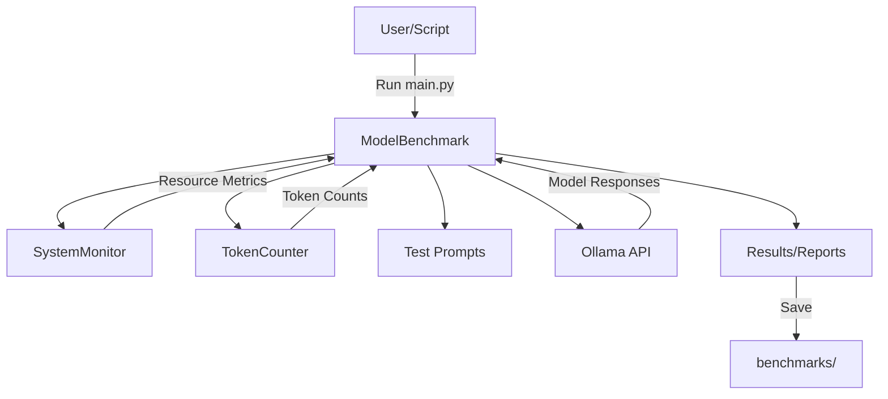

# LLM Benchmark Lab: Architecture Overview

## System Overview

The LLM Benchmark Lab is a modular Python system for benchmarking large language models (LLMs) running on Ollama. It measures model performance, system resource usage, and generates detailed reports. The system is designed for extensibility, reproducibility, and ease of use for both end-users and developers.

### Key Components
- **benchmark_models/main.py**: Entrypoint script for running benchmarks and generating reports.
- **benchmark_models/model_benchmark.py**: Core benchmarking logic, including orchestration, metrics aggregation, and reporting.
- **benchmark_models/system_monitor.py**: Real-time system resource monitoring (CPU, memory, GPU, model size, load time).
- **benchmark_models/token_counter.py**: Accurate token counting using HuggingFace and tiktoken, with fallback logic.
- **benchmark_models/test_prompts.py**: Test prompt definitions for benchmarking scenarios.
- **benchmarks/**: Output directory for results, reports, and model responses.

## Data Flow Diagram

## Module Responsibilities

### main.py
- Orchestrates the entire benchmarking process
- Instantiates `ModelBenchmark`
- Runs benchmarks for all models and prompts
- Prints summary and saves results/reports

### model_benchmark.py
- Defines `ModelBenchmark` class
- Manages model and tokenizer mappings
- Runs benchmarks with streaming and accurate timing
- Aggregates metrics across runs and prompts
- Generates markdown and JSON reports
- Handles saving of model responses

### system_monitor.py
- Defines `SystemMonitor` class
- Monitors CPU, memory, and GPU usage in a background thread
- Measures model load time
- Extracts model size and parameter info from Ollama
- Returns resource metrics to `ModelBenchmark`

### token_counter.py
- Defines `TokenCounter` class
- Provides model-specific token counting using HuggingFace tokenizers
- Falls back to tiktoken or regex-based counting if needed
- Ensures accurate token metrics for all models

### test_prompts.py
- Contains a list of test prompts for benchmarking
- Easily extensible for new scenarios

## Design Patterns Used

- **Modularization**: Each major concern (benchmarking, monitoring, token counting) is encapsulated in its own module/class.
- **Strategy Pattern**: Token counting uses a strategy-like approach, trying model-specific, then general, then fallback methods.
- **Separation of Concerns**: System monitoring, benchmarking, and reporting are cleanly separated.
- **Factory/Registry**: Model and tokenizer mappings act as registries for supported models/tokenizers.
- **Threading**: System resource monitoring runs in a background thread for real-time metrics.
- **Extensible Output**: Results and reports are saved in both machine-readable (JSON) and human-readable (Markdown) formats.

## Extension Points

- **Adding New Models**: Update the `self.models` dictionary in `ModelBenchmark`.
- **Custom Tokenizers**: Add to `self.model_tokenizer_map` for new model/tokenizer pairs.
- **New Metrics**: Extend `SystemMonitor` or `ModelBenchmark` to collect and aggregate additional metrics.
- **Quality Evaluation**: Implement response quality scoring in `ModelBenchmark` (currently a placeholder).
- **Custom Prompts**: Add new prompts to `test_prompts.py`.
- **Output Formats**: Extend report generation for new formats (e.g., HTML, CSV).
- **Integration**: The modular design allows integration with other model serving backends or monitoring tools.

---

This architecture enables robust, extensible, and reproducible benchmarking of LLMs, supporting both rapid experimentation and in-depth analysis. 